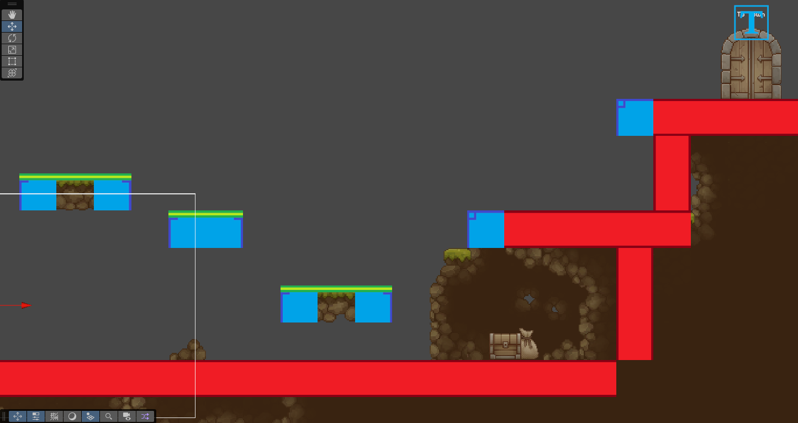

  
  
  

<h3>My first Unity study project ~</h3>

If you like some of the assets used in this project please check & support the amazing artists who created them (<a href="https://github.com/OlhaSmachna/UnityTestGame/blob/main/CREDITS.md">Credits</a>).

This is a place to track progress of my Unity learning journey. I won't be making the project itself public because of the paid assets I'm using, so instead I'm planning to use this page as a devlog-style showcase of implemented features and skills I learn along the way, possibly posting some of my own code & assets in the future.

My only previous expirience with Unity amounts to short 2-week uni cource where I began to develop this game as an exam project. So here's where my game stands as of now - at the beginning of my personal learning expirience.

My first goal is to figure out a new level building structure that will be easier to manage ans scale. For this purpose I'm switching old manually placed box colliders, that defined floors and walls of game levels, to a system of tilemap colliders: four tilemaps responsible for floors, walls, edges, and platforms collisions. Adding composite collider and setting composite operation type to "merge" to increase perfomance.

For each tilemap, I'm adding it's own sprite to easily distinguish them. Now I can paint my colliders on top of the environmental sprites or quckly create levels from the start and then simply disable sprite render components on collision tilemaps.

To add a little more life to my game world I want to change a static backgroung to a dynamic animated one. For this I'm creating a parallax background following <a href="https://www.youtube.com/playlist?list=PLgdPM_ttyxwsnvb0cgWgicyGu8wNycfoY">this tutorial</a>.

